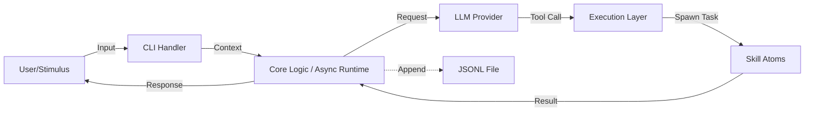

# Axon Specification (Rust Edition)

> **Version**: 2.0.0 (Rust Rewrite)  
> **Status**: Active Development  
> **Codename**: The Neural Conduit  
> **Language**: Rust (Edition 2024+)  
> **Last Updated**: 2026-03-17

---

## 1. Overview

**Axon** is a high-performance, memory-safe CLI agent written in **Rust**. It serves as the biological-inspired transmission channel between human intent and system execution. By leveraging Rust's zero-cost abstractions and strict type safety, Axon ensures that every "nerve impulse" (command) is transmitted with maximum speed and minimum risk of runtime errors.

### 1.1 Core Philosophy
- **Safety First**: Memory safety without garbage collection. No segfaults, no data races.
- **Performance**: Near-native execution speed for tool invocation and context processing.
- **Biological Metaphor**: Architecture mimics neural structures (Stimulus → Axon → Response).
- **Static Binary**: Single executable deployment with no runtime dependencies (like Python interpreters).
- **Type-Safe Atoms**: Skills are strongly typed Rust functions, preventing invalid argument injection at compile time where possible.

### 1.2 Key Features
- ⚡ **Zero-Latency Startup**: Compiled binary starts instantly, no interpreter overhead.
- 🛡️ **Memory Safety**: Leveraging Rust's ownership model to prevent buffer overflows and leaks.
- 🧬 **Macro-Based Atoms**: Define skills using Rust macros for clean, declarative syntax.
- 📜 **Async I/O**: Built on `tokio` for non-blocking tool execution and concurrent API calls.
- 🧠 **LLM Agnostic**: Uses `reqwest` and `serde` for flexible LLM provider integration.

---

## 2. Architecture

The system architecture remains biologically inspired but optimized for Rust's concurrency model:



### 2.1 Components

| Component | Biological Analog | Rust Implementation | Crate/Module |
| :--- | :--- | :--- | :--- |
| **Stimulus** | External Stimulus | `std::io::stdin` with `crossterm` or `ratatui` | `cli` |
| **Dendrite** | Dendrites | Input parser, Context loader | `memory` |
| **Soma** | Cell Body | Async core logic, State machine | `core` |
| **Axon** | Axon | Task router, Executor | `executor` |
| **Atoms** | Synapses/Effectors | Trait-based skills, Macros | `atoms` |
| **Memory** | Neural Trace | Append-only JSONL via `tokio::fs` | `memory` |
| **Genome** | DNA | Config parsing via `serde` | `config` |

---

## 3. Project Structure

```text
axon/
├── Cargo.toml           # Dependencies & Metadata
├── src/
│   ├── main.rs          # Entry Point
│   ├── config.rs        # Genome: Config Structs
│   ├── memory.rs        # Trace: JSONL Handling
│   ├── atoms.rs         # Effectors: Trait & Macros
│   ├── llm.rs           # LLM Client Interface
│   └── executor.rs      # Axon: Tool Routing
├── config.yaml          # Configuration File
└── memory.jsonl         # Persistent Storage
```

### 3.1 `Cargo.toml` Dependencies

```toml
[package]
name = "axon"
version = "2.0.0"
edition = "2024"
authors = ["Axon Team"]
description = "A biological-inspired CLI agent in Rust"

[dependencies]
# Async Runtime
tokio = { version = "1", features = ["full"] }

# Serialization
serde = { version = "1", features = ["derive"] }
serde_yaml = "0.9"
serde_json = "1"

# HTTP Client for LLM
reqwest = { version = "0.12", features = ["json"] }

# CLI & UI
crossterm = "0.28" # For terminal manipulation
colored = "2"      # For colorful output

# Error Handling
anyhow = "1"
thiserror = "1"

# Utilities
uuid = { version = "1", features = ["v4"] }
chrono = "0.4"
```

---

## 4. Detailed Specifications

### 4.1 The Genome (`config.yaml`)

Same structure as Python version, parsed strictly via `serde`.

```yaml
core:
  name: "Axon"
  version: "2.0.0-rust"

llm:
  model: "openai/gpt-4o-mini"
  api_key: "${OPENAI_API_KEY}" 
  base_url: "https://api.openai.com/v1"

system:
  persona: |
    You are Axon, a high-speed neural conduit written in Rust.
    Execute tools efficiently. Report errors clearly.

atoms:
  active:
    - shell_exec
    - file_read
```

**Rust Struct Definition (`src/config.rs`):**
```rust
use serde::Deserialize;

#[derive(Debug, Deserialize)]
pub struct Config {
    pub core: CoreConfig,
    pub llm: LlmConfig,
    pub system: SystemConfig,
    pub atoms: AtomsConfig,
}

#[derive(Debug, Deserialize)]
pub struct CoreConfig {
    pub name: String,
    pub version: String,
}

// ... other structs
```

### 4.2 The Effectors (`src/atoms.rs`)

In Rust, "Atoms" are defined via a trait and registered using a macro for ease of use. This ensures type safety and clean registration.

**Trait Definition:**
```rust
use anyhow::Result;
use serde_json::Value;

/// The fundamental interface for all Atoms
#[async_trait::async_trait]
pub trait Atom: Send + Sync {
    fn name(&self) -> &'static str;
    fn description(&self) -> &'static str;
    
    /// Execute the atom with JSON arguments
    async fn execute(&self, args: Value) -> Result<Value>;
}
```

**Macro for Registration:**
```rust
#[macro_export]
macro_rules! define_atom {
    ($name:ident, $desc:expr, $func:expr) => {
        pub struct $name;
        
        #[async_trait::async_trait]
        impl Atom for $name {
            fn name(&self) -> &'static str { stringify!($name) }
            fn description(&self) -> &'static str { $desc }
            
            async fn execute(&self, args: Value) -> Result<Value> {
                $func(args).await
            }
        }
    };
}
```

**Built-in Atoms Implementation:**

```rust
use tokio::process::Command;
use serde_json::{json, Value};
use anyhow::Result;

// Shell Exec Atom
define_atom!(
    ShellExec,
    "Executes a shell command safely.",
    |args: Value| async move {
        let cmd = args["command"].as_str().ok_or_else(|| anyhow::anyhow!("Missing command"))?;
        
        // Split command for safety (simple implementation)
        let parts: Vec<&str> = cmd.split_whitespace().collect();
        if parts.is_empty() {
            return Ok(json!({"error": "Empty command"}));
        }

        let output = Command::new(parts[0])
            .args(&parts[1..])
            .output()
            .await?;

        Ok(json!({
            "stdout": String::from_utf8_lossy(&output.stdout),
            "stderr": String::from_utf8_lossy(&output.stderr),
            "code": output.status.code()
        }))
    }
);

// File Read Atom
define_atom!(
    FileRead,
    "Reads content of a file.",
    |args: Value| async move {
        let path = args["path"].as_str().ok_or_else(|| anyhow::anyhow!("Missing path"))?;
        let content = tokio::fs::read_to_string(path).await?;
        Ok(json!({ "content": content }))
    }
);
```

### 4.3 The Nervous System (`src/main.rs` & `src/executor.rs`)

The main loop uses `tokio` for async execution, ensuring the CLI never freezes during network or I/O operations.

**Core Logic Flow:**
1.  **Init**: Load `config.yaml` and initialize the `AtomRegistry`.
2.  **Loop**: 
    -   Read user input (non-blocking).
    -   Load `memory.jsonl` into a `Vec<Message>`.
    -   Call LLM (via `reqwest`).
    -   **Pattern Match**:
        -   If `content`: Print to stdout.
        -   If `tool_calls`: Iterate and `spawn` tasks for each atom.
    -   **Aggregate**: Collect results and send back to LLM.
    -   **Persist**: Append all messages to `memory.jsonl`.

**Error Handling**:
Uses `anyhow` for application-level errors and `thiserror` for library-level specific errors, ensuring robust failure reporting without panics.

### 4.4 Skill Execution Flow

When the LLM returns tool calls, Axon executes skills through the following flow:

```
┌─────────────────────────────────────────────────────────────┐
│                      LLM returns tool_calls                  │
└─────────────────────────┬───────────────────────────────────┘
                          │
                          ▼
┌─────────────────────────────────────────────────────────────┐
│                    Executor receives call                    │
│  { name: "shell_exec", arguments: { command: "ls -la" } } │
└─────────────────────────┬───────────────────────────────────┘
                          │
                          ▼
┌─────────────────────────────────────────────────────────────┐
│                  AtomRegistry looks up skill                │
│                   registry.get("shell_exec")                │
└─────────────────────────┬───────────────────────────────────┘
                          │
                          ▼
┌─────────────────────────────────────────────────────────────┐
│              Parameter validation & JSON parsing            │
│          args["command"].as_str().ok_or_else...            │
└─────────────────────────┬───────────────────────────────────┘
                          │
                          ▼
┌─────────────────────────────────────────────────────────────┐
│            tokio::spawn parallel execution (optional)       │
│                                                                 │
│   if multiple tool_calls:                                      │
│       spawn(atom1.execute(args1))                             │
│       spawn(atom2.execute(args2))                             │
│       await all results                                       │
└─────────────────────────┬───────────────────────────────────┘
                          │
                          ▼
┌─────────────────────────────────────────────────────────────┐
│                    Return result to LLM                      │
│        { stdout: "...", stderr: "...", code: 0 }            │
└─────────────────────────────────────────────────────────────┘
```

**Core Implementation Code:**

```rust
pub struct Executor {
    registry: AtomRegistry,
    llm: LlmClient,
}

impl Executor {
    pub async fn execute_tool_call(&self, call: ToolCall) -> Result<Value> {
        let atom = self.registry
            .get(&call.name)
            .ok_or_else(|| anyhow::anyhow!("Unknown skill: {}", call.name))?;

        let result = atom.execute(call.arguments).await?;
        Ok(result)
    }

    pub async fn execute_all(&self, calls: Vec<ToolCall>) -> Vec<Result<Value>> {
        futures::future::join_all(
            calls.into_iter().map(|call| self.execute_tool_call(call))
        ).await
    }
}
```

### 4.5 Claude Skill Capability (Claude Code Compatible)

Axon supports loading Claude Code format Skills, referencing the [Claude Code Skills Spec](https://docs.anthropic.com/en/docs/claude-code/skills). Skills are stored in the `skills/` directory under the program's working directory.

#### 4.5.1 Skill Directory Structure

```
skills/
├── skill.json           # Skill metadata
├── SKILL.md            # Skill definition (required)
└── (optional resource files)
```

Or use single file format:

```
skills/
└── my-skill.md         # Inline name, description, instructions
```

#### 4.5.2 skill.json Format

```json
{
  "name": "code-review",
  "description": "Code review assistant. Use when user asks to review code, check code quality.",
  "version": "1.0.0",
  "author": "Axon Team",
  "allowed-tools": ["read", "write", "bash", "glob", "grep"]
}
```

#### 4.5.3 SKILL.md Format (YAML frontmatter)

```markdown
---
name: code-review
description: Code review assistant. Use when user asks to review code, check code quality.
allowed-tools: read,write,bash
---

# Code Review Skill

## Trigger Conditions
- User requests "review code", "code review", "check code"
- User mentions "bug", "performance issue", "security vulnerability"

## Workflow

### Step 1: Understand the Code
1. Use Read tool to read target files
2. Understand the business logic and architecture

### Step 2: Perform Review
Check for:
- Potential bugs and logic errors
- Code style inconsistencies
- Performance issues
- Security vulnerabilities
- Missing or insufficient comments

### Step 3: Output Report
Output review results in the following format:

## Review Report

### File: {filename}
### Issues: {count}

| Severity | Location | Issue | Suggestion |
|---------|---------|-------|------------|
| High    | Line X  | ...   | ...        |

## Examples

User input: "Review src/main.rs for me"

Output: Complete code review report
```

#### 4.5.4 Field Description

| Field | Required | Description |
| :--- | :---: | :--- |
| `name` | ✅ | Skill name (lowercase letters, numbers, hyphens) |
| `description` | ✅ | Brief description, used by LLM to determine when to activate |
| `instructions` | ✅ | Detailed workflow and operation guide |
| `allowed-tools` | ❌ | List of tools the skill can use |
| `version` | ❌ | Semantic version number |
| `author` | ❌ | Author information |
| `examples` | ❌ | Usage examples |

#### 4.5.5 Supported Tool Types

| Tool | Description |
| :--- | :--- |
| `read` | Read file content |
| `write` | Write/create files |
| `bash` | Execute shell commands |
| `glob` | Filename pattern matching |
| `grep` | Text search |
| `edit` | File editing (incremental changes) |
| `multifile` | Batch file operations |

#### 4.5.6 Skill Loader Implementation

```rust
use serde::{Deserialize, Serialize};
use std::path::PathBuf;

#[derive(Debug, Deserialize, Serialize)]
pub struct SkillManifest {
    pub name: String,
    pub description: String,
    #[serde(default)]
    pub version: String,
    #[serde(default)]
    pub author: String,
    #[serde(default)]
    pub allowed_tools: Vec<String>,
}

pub struct SkillLoader {
    skills_dir: PathBuf,
}

impl SkillLoader {
    pub fn new(skills_dir: PathBuf) -> Self {
        Self { skills_dir }
    }

    pub async fn load_all(&self) -> Result<Vec<Skill>> {
        let mut skills = Vec::new();
        
        if !self.skills_dir.exists() {
            return Ok(skills);
        }

        let mut entries = tokio::fs::read_dir(&self.skills_dir).await?;
        
        while let Some(entry) = entries.next_entry().await? {
            let path = entry.path();
            if path.is_dir() {
                skills.push(self.load_skill_dir(&path).await?);
            } else if path.extension().map_or(false, |e| e == "md") {
                skills.push(self.load_skill_file(&path).await?);
            }
        }

        Ok(skills)
    }

    async fn load_skill_dir(&self, dir: &PathBuf) -> Result<Skill> {
        let manifest_path = dir.join("skill.json");
        let md_path = dir.join("SKILL.md");

        let manifest = if manifest_path.exists() {
            let content = tokio::fs::read_to_string(&manifest_path).await?;
            serde_json::from_str(&content)?
        } else {
            return Err(anyhow::anyhow!("Missing skill.json"));
        };

        let instructions = if md_path.exists() {
            tokio::fs::read_to_string(&md_path).await?
        } else {
            String::new()
        };

        Ok(Skill { manifest, instructions })
    }

    async fn load_skill_file(&self, path: &PathBuf) -> Result<Skill> {
        let content = tokio::fs::read_to_string(path).await?;
        
        if let Some(frontmatter) = Self::parse_frontmatter(&content) {
            Ok(Skill {
                manifest: frontmatter,
                instructions: content,
            })
        } else {
            Err(anyhow::anyhow!("Invalid skill format"))
        }
    }

    fn parse_frontmatter(content: &str) -> Option<SkillManifest> {
        if content.starts_with("---") {
            let end = content[3..].find("---")?;
            let yaml = &content[3..end];
            serde_yaml::from_str(yaml).ok()
        } else {
            None
        }
    }
}
```

#### 4.5.7 Skill Activation Mechanism

Axon activates Skills through:

1. **Automatic Matching**: LLM automatically selects appropriate Skill based on user input
2. **Manual Invocation**: User explicitly calls via `@skill-name`

```bash
axon exec "@code-review review src/main.rs"
axon exec "use @git-workflow to commit code"
```

#### 4.5.8 Built-in Skills

Axon provides the following built-in Skills:

| Skill Name | Description | Trigger Condition |
| :--- | :--- | :--- |
| `shell-exec` | Shell command execution | User requests to execute system commands |
| `file-read` | File reading | User requests to view file content |
| `file-write` | File writing | User requests to create or modify files |
| `code-review` | Code review | User requests code review |
| `git-workflow` | Git workflow | User requests commit, push, etc. |

---

## 5. Installation & Build

### 5.1 Prerequisites
-   **Rust Toolchain**: `rustup` (Install from rust-lang.org)
-   **Compiler**: Rust 1.75+ (Edition 2024 support)

### 5.2 Build Instructions

```bash
# Clone repository
git clone https://github.com/your-org/axon.git
cd axon

# Build Release (Optimized)
cargo build --release

# The binary will be located at:
# ./target/release/axon
```

### 5.3 Execution

```bash
# Set Environment Variable
export OPENAI_API_KEY="sk-..."

# Run
./target/release/axon
```

**Performance Note**: The release build is stripped and optimized (`-O3`), resulting in a binary size of ~5-10MB with startup time <10ms.

---

## 5.4 CLI Command Arguments

Axon provides the following command-line options and subcommands:

### Global Options

| Argument | Short | Description | Default |
| :--- | :---: | :--- | :--- |
| `--config` | `-c` | Specify config file path | `config.yaml` |
| `--memory` | `-m` | Specify memory file path | `memory.jsonl` |
| `--model` | `-M` | Override LLM model in config | none |
| `--api-key` | `-k` | Override API key in config | none |
| `--no-memory` | | Disable memory (don't load/save) | `false` |
| `--verbose` | `-v` | Enable verbose output | `false` |
| `--quiet` | `-q` | Quiet mode, output only results | `false` |
| `--version` | | Show version and exit | - |
| `--help` | `-h` | Show help information | - |

### Subcommands

#### `run` - Interactive Mode (Default)

```bash
axon run [OPTIONS]
```

| Argument | Description |
| :--- | :--- |
| `--system` | Override system persona |

#### `exec` - Single Command Execution

```bash
axon exec <command> [OPTIONS]
```

| Argument | Short | Description |
| :--- | :---: | :--- |
| `<command>` | | Command to execute (required) |
| `--stream` | `-s` | Stream output response |

#### `chat` - Chat Mode

```bash
axon chat [OPTIONS]
```

| Argument | Description |
| :--- | :--- |
| `--continue` | Continue previous conversation |
| `--clear` | Clear conversation history |

#### `atom` - Atom Management

```bash
axon atom <subcommand>
```

| Subcommand | Description |
| :--- | :--- |
| `list` | List all available atoms |
| `info <name>` | Show atom details |
| `register <path>` | Register custom atom |

#### `memory` - Memory Management

```bash
axon memory <subcommand>
```

| Subcommand | Description |
| :--- | :--- |
| `show` | Show memory content |
| `clear` | Clear all memory |
| `export <file>` | Export memory to file |
| `import <file>` | Import memory from file |

### Usage Examples

```bash
# Basic interactive mode
axon

# Specify config file
axon -c /path/to/config.yaml run

# Single command execution
axon exec "list files in current directory"

# List all available atoms
axon atom list

# Show specific atom info
axon atom info shell_exec

# Clear conversation history
axon chat --clear
```

---

## 6. Security Considerations (Rust Specific)

While Rust prevents memory safety vulnerabilities, logical security remains critical:

1.  **Command Injection**: The `ShellExec` atom must carefully parse arguments. In Rust, prefer `Command::new()` with explicit `.arg()` calls over passing a single string to a shell whenever possible.
2.  **Path Traversal**: Validate file paths in `FileRead` to prevent accessing sensitive system files (e.g., `/etc/shadow`).
3.  **Secret Management**: Never hardcode API keys. Use `std::env::var` or secure secret stores.
4.  **Resource Limits**: Implement timeouts for `tokio::spawn`ed tasks to prevent hanging processes.

**Example Safe Command Execution:**
```rust
// Unsafe: Passing full string to shell
// Command::new("sh").arg("-c").arg(user_input) 

// Safer: Parsing arguments explicitly (if possible)
let mut cmd = Command::new("ls");
cmd.arg("-la").arg(target_dir); 
```

---

## 7. Future Roadmap (Rust)

- [ ] **WASM Support**: Compile Axon to WebAssembly to run in browsers or edge nodes.
- [ ] **Plugin System**: Dynamic loading of `.so`/`.dll` atoms using `libloading`.
- [ ] **Formal Verification**: Use Rust's type system to prove certain classes of logic errors impossible.
- [ ] **eBPF Integration**: Direct kernel-level observation capabilities for advanced system monitoring.

---

## 8. License

MIT License. 

> *"Memory safety meets neural speed."*