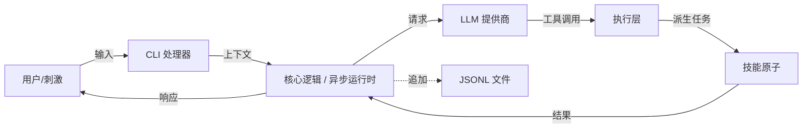

# Axon 规范 (Rust 版)

> **版本**: 2.0.0 (Rust 重写)  
> **状态**: 积极开发中  
> **代号**: 神经导管  
> **语言**: Rust (2024 版+)  
> **最后更新**: 2026-03-17

---

## 1. 概述

**Axon** 是一个高性能、内存安全的 CLI 代理，使用 **Rust** 编写。它作为人类意图与系统执行之间的生物启发式传输通道。借助 Rust 的零成本抽象和严格类型安全，Axon 确保每一次"神经冲动"（命令）都以最快速度传输，且运行时错误风险最小。

### 1.1 核心哲学
- **安全优先**: 无垃圾回收的内存安全。无段错误，无数据竞争。
- **性能**: 工具调用和上下文处理接近原生执行速度。
- **生物隐喻**: 架构模仿神经结构（刺激 → 轴突 → 反应）。
- **静态二进制**: 单可执行文件部署，无运行时依赖（如 Python 解释器）。
- **类型安全原子**: 技能是强类型 Rust 函数，在编译时尽可能防止无效参数注入。

### 1.2 核心特性
- ⚡ **零延迟启动**: 编译后的二进制文件即时启动，无解释器开销。
- 🛡️ **内存安全**: 利用 Rust 的所有权模型防止缓冲区溢出和泄漏。
- 🧬 **宏驱动的原子**: 使用 Rust 宏定义技能，语法简洁声明式。
- 📜 **异步 I/O**: 基于 `tokio` 构建，实现非阻塞工具执行和并发 API 调用。
- 🧠 **LLM 无关**: 使用 `reqwest` 和 `serde` 实现灵活的 LLM 提供商集成。

---

## 2. 架构

系统架构保持生物启发式，同时针对 Rust 的并发模型进行了优化：



### 2.1 组件

| 组件 | 生物对应 | Rust 实现 | crate/模块 |
| :--- | :--- | :--- | :--- |
| **刺激** | 外部刺激 | `std::io::stdin` 配合 `crossterm` 或 `ratatui` | `cli` |
| **树突** | 树突 | 输入解析器，上下文加载器 | `memory` |
| **胞体** | 细胞体 | 异步核心逻辑，状态机 | `core` |
| **轴突** | 轴突 | 任务路由器，执行器 | `executor` |
| **原子** | 突触/效应器 | 基于 trait 的技能，宏 | `atoms` |
| **记忆** | 神经痕迹 | 追加写入的 JSONL，通过 `tokio::fs` | `memory` |
| **基因组** | DNA | 通过 `serde` 解析配置 | `config` |

---

## 3. 项目结构

```text
axon/
├── Cargo.toml           # 依赖和元数据
├── src/
│   ├── main.rs          # 入口点
│   ├── config.rs        # 基因组：配置结构体
│   ├── memory.rs        # 痕迹：JSONL 处理
│   ├── atoms.rs         # 效应器：trait 和宏
│   ├── llm.rs           # LLM 客户端接口
│   ├── executor.rs      # 轴突：工具路由
├── config.yaml          # 配置文件
└── memory.jsonl         # 持久化存储
```

### 3.1 `Cargo.toml` 依赖

```toml
[package]
name = "axon"
version = "2.0.0"
edition = "2024"
authors = ["Axon Team"]
description = "A biological-inspired CLI agent in Rust"

[dependencies]
# 异步运行时
tokio = { version = "1", features = ["full"] }

# 序列化
serde = { version = "1", features = ["derive"] }
serde_yaml = "0.9"
serde_json = "1"

# LLM HTTP 客户端
reqwest = { version = "0.12", features = ["json"] }

# CLI 和 UI
crossterm = "0.28" # 终端操作
colored = "2"      # 彩色输出

# 错误处理
anyhow = "1"
thiserror = "1"

# 工具
uuid = { version = "1", features = ["v4"] }
chrono = "0.4"
```

---

## 4. 详细规范

### 4.1 基因组 (`config.yaml`)

与 Python 版结构相同，通过 `serde` 严格解析。

```yaml
core:
  name: "Axon"
  version: "2.0.0-rust"

llm:
  model: "openai/gpt-4o-mini"
  api_key: "${OPENAI_API_KEY}" 
  base_url: "https://api.openai.com/v1"

system:
  persona: |
    You are Axon, a high-speed neural conduit written in Rust.
    Execute tools efficiently. Report errors clearly.

atoms:
  active:
    - shell_exec
    - file_read
```

**Rust 结构体定义 (`src/config.rs`):**
```rust
use serde::Deserialize;

#[derive(Debug, Deserialize)]
pub struct Config {
    pub core: CoreConfig,
    pub llm: LlmConfig,
    pub system: SystemConfig,
    pub atoms: AtomsConfig,
}

#[derive(Debug, Deserialize)]
pub struct CoreConfig {
    pub name: String,
    pub version: String,
}

// ... 其他结构体
```

### 4.2 效应器 (`src/atoms.rs`)

在 Rust 中，"原子"通过 trait 定义，并使用宏注册以确保类型安全和简洁的注册流程。

**Trait 定义:**
```rust
use anyhow::Result;
use serde_json::Value;

/// 所有原子的基本接口
#[async_trait::async_trait]
pub trait Atom: Send + Sync {
    fn name(&self) -> &'static str;
    fn description(&self) -> &'static str;
    
    /// 使用 JSON 参数执行原子
    async fn execute(&self, args: Value) -> Result<Value>;
}
```

**注册宏:**
```rust
#[macro_export]
macro_rules! define_atom {
    ($name:ident, $desc:expr, $func:expr) => {
        pub struct $name;
        
        #[async_trait::async_trait]
        impl Atom for $name {
            fn name(&self) -> &'static str { stringify!($name) }
            fn description(&self) -> &'static str { $desc }
            
            async fn execute(&self, args: Value) -> Result<Value> {
                $func(args).await
            }
        }
    };
}
```

**内置原子实现:**

```rust
use tokio::process::Command;
use serde_json::{json, Value};
use anyhow::Result;

// Shell 执行原子
define_atom!(
    ShellExec,
    "安全地执行 shell 命令。",
    |args: Value| async move {
        let cmd = args["command"].as_str().ok_or_else(|| anyhow::anyhow!("缺少命令"))?;
        
        // 分割命令以保证安全（简单实现）
        let parts: Vec<&str> = cmd.split_whitespace().collect();
        if parts.is_empty() {
            return Ok(json!({"error": "空命令"}));
        }

        let output = Command::new(parts[0])
            .args(&parts[1..])
            .output()
            .await?;

        Ok(json!({
            "stdout": String::from_utf8_lossy(&output.stdout),
            "stderr": String::from_utf8_lossy(&output.stderr),
            "code": output.status.code()
        }))
    }
);

// 文件读取原子
define_atom!(
    FileRead,
    "读取文件内容。",
    |args: Value| async move {
        let path = args["path"].as_str().ok_or_else(|| anyhow::anyhow!("缺少路径"))?;
        let content = tokio::fs::read_to_string(path).await?;
        Ok(json!({ "content": content }))
    }
);
```

### 4.3 神经系统 (`src/main.rs` 和 `src/executor.rs`)

主循环使用 `tokio` 进行异步执行，确保 CLI 在网络或 I/O 操作期间不会冻结。

**核心逻辑流程:**
1.  **初始化**: 加载 `config.yaml` 并初始化 `AtomRegistry`。
2.  **循环**: 
    -   读取用户输入（非阻塞）。
    -   将 `memory.jsonl` 加载到 `Vec<Message>` 中。
    -   调用 LLM（通过 `reqwest`）。
    -   **模式匹配**:
        -   如果是 `content`: 输出到 stdout。
        -   如果是 `tool_calls`: 遍历并为每个原子 `spawn` 任务。
    -   **聚合**: 收集结果并发送回 LLM。
    -   **持久化**: 将所有消息追加到 `memory.jsonl`。

**错误处理**:
使用 `anyhow` 处理应用级错误，使用 `thiserror` 处理库级特定错误，确保稳健的失败报告而不会 panic。

### 4.4 技能执行流程

当 LLM 返回工具调用时，Axon 通过以下流程执行技能：

```
┌─────────────────────────────────────────────────────────────┐
│                      LLM 返回 tool_calls                     │
└─────────────────────────┬───────────────────────────────────┘
                          │
                          ▼
┌─────────────────────────────────────────────────────────────┐
│                    Executor 接收调用                         │
│  { name: "shell_exec", arguments: { command: "ls -la" } }  │
└─────────────────────────┬───────────────────────────────────┘
                          │
                          ▼
┌─────────────────────────────────────────────────────────────┐
│                  AtomRegistry 查找技能                       │
│                   registry.get("shell_exec")                │
└─────────────────────────┬───────────────────────────────────┘
                          │
                          ▼
┌─────────────────────────────────────────────────────────────┐
│              参数验证 & JSON 解析                             │
│          args["command"].as_str().ok_or_else...             │
└─────────────────────────┬───────────────────────────────────┘
                          │
                          ▼
┌─────────────────────────────────────────────────────────────┐
│            tokio::spawn 并行执行 (可选)                       │
│                                                                 │
│   if multiple tool_calls:                                      │
│       spawn(atom1.execute(args1))                              │
│       spawn(atom2.execute(args2))                              │
│       await all results                                       │
└─────────────────────────┬───────────────────────────────────┘
                          │
                          ▼
┌─────────────────────────────────────────────────────────────┐
│                    返回结果给 LLM                             │
│        { stdout: "...", stderr: "...", code: 0 }            │
└─────────────────────────────────────────────────────────────┘
```

**核心实现代码:**

```rust
pub struct Executor {
    registry: AtomRegistry,
    llm: LlmClient,
}

impl Executor {
    pub async fn execute_tool_call(&self, call: ToolCall) -> Result<Value> {
        let atom = self.registry
            .get(&call.name)
            .ok_or_else(|| anyhow::anyhow!("未知技能: {}", call.name))?;

        let result = atom.execute(call.arguments).await?;
        Ok(result)
    }

    pub async fn execute_all(&self, calls: Vec<ToolCall>) -> Vec<Result<Value>> {
        futures::future::join_all(
            calls.into_iter().map(|call| self.execute_tool_call(call))
        ).await
    }
}
```

### 4.5 Claude Skill 能力 (Claude Code 兼容)

Axon 支持加载 Claude Code 格式的 Skill，参考 [Claude Code Skills 规范](https://docs.anthropic.com/en/docs/claude-code/skills)。Skill 存放于程序运行目录下的 `skills/` 目录。

#### 4.5.1 Skill 目录结构

```
skills/
├── skill.json           # Skill 元信息
├── SKILL.md            # 技能定义 (必需)
└── (可选资源文件)
```

或使用单文件格式：

```
skills/
└── my-skill.md         # 内联 name, description, instructions
```

#### 4.5.2 skill.json 格式

```json
{
  "name": "code-review",
  "description": "代码审查助手。当用户请求审查代码、检查代码质量时使用。",
  "version": "1.0.0",
  "author": "Axon Team",
  "allowed-tools": ["read", "write", "bash", "glob", "grep"]
}
```

#### 4.5.3 SKILL.md 格式 (YAML frontmatter)

```markdown
---
name: code-review
description: 代码审查助手。当用户请求审查代码、检查代码质量时使用。
allowed-tools: read,write,bash
---

# 代码审查技能

## 触发条件
- 用户请求 "审查代码"、"code review"、"检查代码"
- 用户提及 "bug"、"性能问题"、"安全漏洞"

## 工作流程

### 第一步：理解代码
1. 使用 Read 工具读取目标文件
2. 理解代码的业务逻辑和架构

### 第二步：执行审查
检查以下方面：
- 潜在 bug 和逻辑错误
- 代码风格不一致
- 性能问题
- 安全漏洞
- 注释缺失或不足

### 第三步：输出报告
按照以下格式输出审查结果：

## 审查报告

### 文件: {filename}
### 问题数: {count}

| 严重程度 | 位置 | 问题描述 | 建议 |
|---------|------|---------|------|
| 高      | 行 X | ...    | ...  |

## 示例

用户输入: "帮我审查 src/main.rs"

输出: 完整的代码审查报告
```

#### 4.5.4 字段说明

| 字段 | 必需 | 描述 |
| :--- | :---: | :--- |
| `name` | ✅ | 技能名称（小写字母、数字、连字符） |
| `description` | ✅ | 简短描述，用于 LLM 判断何时激活该技能 |
| `instructions` | ✅ | 详细的工作流程和操作指南 |
| `allowed-tools` | ❌ | 允许该技能使用的工具列表 |
| `version` | ❌ | 语义化版本号 |
| `author` | ❌ | 作者信息 |
| `examples` | ❌ | 使用示例 |

#### 4.5.5 支持的工具类型

| 工具 | 描述 |
| :--- | :--- |
| `read` | 读取文件内容 |
| `write` | 写入/创建文件 |
| `bash` | 执行 Shell 命令 |
| `glob` | 文件名模式匹配 |
| `grep` | 文本搜索 |
| `edit` | 文件编辑（增量修改） |
| `multifile` | 批量文件操作 |

#### 4.5.6 Skill 加载器实现

```rust
use serde::{Deserialize, Serialize};
use std::path::PathBuf;

#[derive(Debug, Deserialize, Serialize)]
pub struct SkillManifest {
    pub name: String,
    pub description: String,
    #[serde(default)]
    pub version: String,
    #[serde(default)]
    pub author: String,
    #[serde(default)]
    pub allowed_tools: Vec<String>,
}

pub struct SkillLoader {
    skills_dir: PathBuf,
}

impl SkillLoader {
    pub fn new(skills_dir: PathBuf) -> Self {
        Self { skills_dir }
    }

    pub async fn load_all(&self) -> Result<Vec<Skill>> {
        let mut skills = Vec::new();
        
        if !self.skills_dir.exists() {
            return Ok(skills);
        }

        let mut entries = tokio::fs::read_dir(&self.skills_dir).await?;
        
        while let Some(entry) = entries.next_entry().await? {
            let path = entry.path();
            if path.is_dir() {
                skills.push(self.load_skill_dir(&path).await?);
            } else if path.extension().map_or(false, |e| e == "md") {
                skills.push(self.load_skill_file(&path).await?);
            }
        }

        Ok(skills)
    }

    async fn load_skill_dir(&self, dir: &PathBuf) -> Result<Skill> {
        let manifest_path = dir.join("skill.json");
        let md_path = dir.join("SKILL.md");

        let manifest = if manifest_path.exists() {
            let content = tokio::fs::read_to_string(&manifest_path).await?;
            serde_json::from_str(&content)?
        } else {
            return Err(anyhow::anyhow!("缺少 skill.json"));
        };

        let instructions = if md_path.exists() {
            tokio::fs::read_to_string(&md_path).await?
        } else {
            String::new()
        };

        Ok(Skill { manifest, instructions })
    }

    async fn load_skill_file(&self, path: &PathBuf) -> Result<Skill> {
        let content = tokio::fs::read_to_string(path).await?;
        
        if let Some(frontmatter) = Self::parse_frontmatter(&content) {
            Ok(Skill {
                manifest: frontmatter,
                instructions: content,
            })
        } else {
            Err(anyhow::anyhow!("无效的 Skill 格式"))
        }
    }

    fn parse_frontmatter(content: &str) -> Option<SkillManifest> {
        if content.starts_with("---") {
            let end = content[3..].find("---")?;
            let yaml = &content[3..end];
            serde_yaml::from_str(yaml).ok()
        } else {
            None
        }
    }
}
```

#### 4.5.7 Skill 激活机制

Axon 通过以下方式激活 Skill：

1. **自动匹配**: LLM 根据用户输入自动选择合适的 Skill
2. **手动指定**: 用户通过 `@skill-name` 显式调用

```bash
axon exec "@code-review 审查 src/main.rs"
axon exec "用 @git-workflow 提交代码"
```

#### 4.5.8 内置 Skill 示例

Axon 提供以下内置 Skill：

| Skill 名称 | 描述 | 触发条件 |
| :--- | :--- | :--- |
| `shell-exec` | Shell 命令执行 | 用户请求执行系统命令 |
| `file-read` | 文件读取 | 用户请求查看文件内容 |
| `file-write` | 文件写入 | 用户请求创建或修改文件 |
| `code-review` | 代码审查 | 用户请求审查代码 |
| `git-workflow` | Git 工作流 | 用户请求提交、推送等 Git 操作 |

---

## 5. 安装与构建

### 5.1 前置条件
- **Rust 工具链**: `rustup`（从 rust-lang.org 安装）
- **编译器**: Rust 1.75+（支持 2024 版）

### 5.2 构建说明

```bash
# 克隆仓库
git clone https://github.com/your-org/axon.git
cd axon

# 构建发布版（优化）
cargo build --release

# 二进制文件位置:
# ./target/release/axon
```

### 5.3 运行

```bash
# 设置环境变量
export OPENAI_API_KEY="sk-..."

# 运行
./target/release/axon
```

**性能说明**: 发布版本经过剥离和优化（`-O3`），二进制文件大小约 5-10MB，启动时间 <10ms。

---

## 5.1 CLI 命令参数

Axon 提供以下命令行选项和子命令：

### 全局选项

| 参数 | 短选项 | 描述 | 默认值 |
| :--- | :---: | :--- | :--- |
| `--config` | `-c` | 指定配置文件路径 | `config.yaml` |
| `--memory` | `-m` | 指定记忆文件路径 | `memory.jsonl` |
| `--model` | `-M` | 覆盖配置中的 LLM 模型 | 无 |
| `--api-key` | `-k` | 覆盖配置中的 API 密钥 | 无 |
| `--no-memory` | | 禁用记忆功能（不加载/不保存） | `false` |
| `--verbose` | `-v` | 启用详细输出 | `false` |
| `--quiet` | `-q` | 静默模式，仅输出结果 | `false` |
| `--version` | | 显示版本号并退出 | - |
| `--help` | `-h` | 显示帮助信息 | - |

### 子命令

#### `run` - 交互式运行（默认）

```bash
axon run [OPTIONS]
```

| 参数 | 描述 |
| :--- | :--- |
| `--system` | 覆盖系统人设 |

#### `exec` - 单次命令执行

```bash
axon exec <命令> [选项]
```

| 参数 | 短选项 | 描述 |
| :--- | :---: | :--- |
| `<命令>` | | 要执行的指令（必需） |
| `--stream` | `-s` | 流式输出响应 |

#### `chat` - 对话模式

```bash
axon chat [OPTIONS]
```

| 参数 | 描述 |
| :--- | :--- |
| `--continue` | 继续上一次对话 |
| `--clear` | 清除对话历史 |

#### `atom` - 原子管理

```bash
axon atom <子命令>
```

| 子命令 | 描述 |
| :--- | :--- |
| `list` | 列出所有可用原子 |
| `info <名称>` | 显示原子详细信息 |
| `register <路径>` | 注册自定义原子 |

#### `memory` - 记忆管理

```bash
axon memory <子命令>
```

| 子命令 | 描述 |
| :--- | :--- |
| `show` | 显示记忆内容 |
| `clear` | 清除所有记忆 |
| `export <文件>` | 导出记忆到文件 |
| `import <文件>` | 从文件导入记忆 |

### 使用示例

```bash
# 基本交互模式
axon

# 指定配置文件
axon -c /path/to/config.yaml run

# 单次命令执行
axon exec "列出当前目录文件"

# 列出所有可用原子
axon atom list

# 查看特定原子信息
axon atom info shell_exec

# 清除对话历史
axon chat --clear
```

---

## 6. 安全考量（Rust 特有）

虽然 Rust 防止了内存安全漏洞，但逻辑安全仍然至关重要：

1.  **命令注入**: `ShellExec` 原子必须仔细解析参数。在 Rust 中，尽可能使用 `Command::new()` 配合显式的 `.arg()` 调用，而不是将单个字符串传递给 shell。
2.  **路径遍历**: 验证 `FileRead` 中的文件路径，防止访问敏感系统文件（如 `/etc/shadow`）。
3.  **密钥管理**: 永不硬编码 API 密钥。使用 `std::env::var` 或安全的密钥存储。
4.  **资源限制**: 为 `tokio::spawn` 的任务实现超时，防止进程挂起。

**安全命令执行示例:**
```rust
// 不安全：将完整字符串传递给 shell
// Command::new("sh").arg("-c").arg(user_input) 

// 更安全：显式解析参数（如可能）
let mut cmd = Command::new("ls");
cmd.arg("-la").arg(target_dir); 
```

---

## 7. 未来路线图（Rust）

- [ ] **WASM 支持**: 将 Axon 编译为 WebAssembly 以在浏览器或边缘节点运行。
- [ ] **插件系统**: 使用 `libloading` 动态加载 `.so`/`.dll` 原子。
- [ ] **形式化验证**: 使用 Rust 的类型系统证明某些类别的逻辑错误不可能发生。
- [ ] **eBPF 集成**: 直接在内核级别进行观察，实现高级系统监控能力。

---

## 8. 许可证

MIT 许可证。

> *"内存安全与神经速度并存。"*
